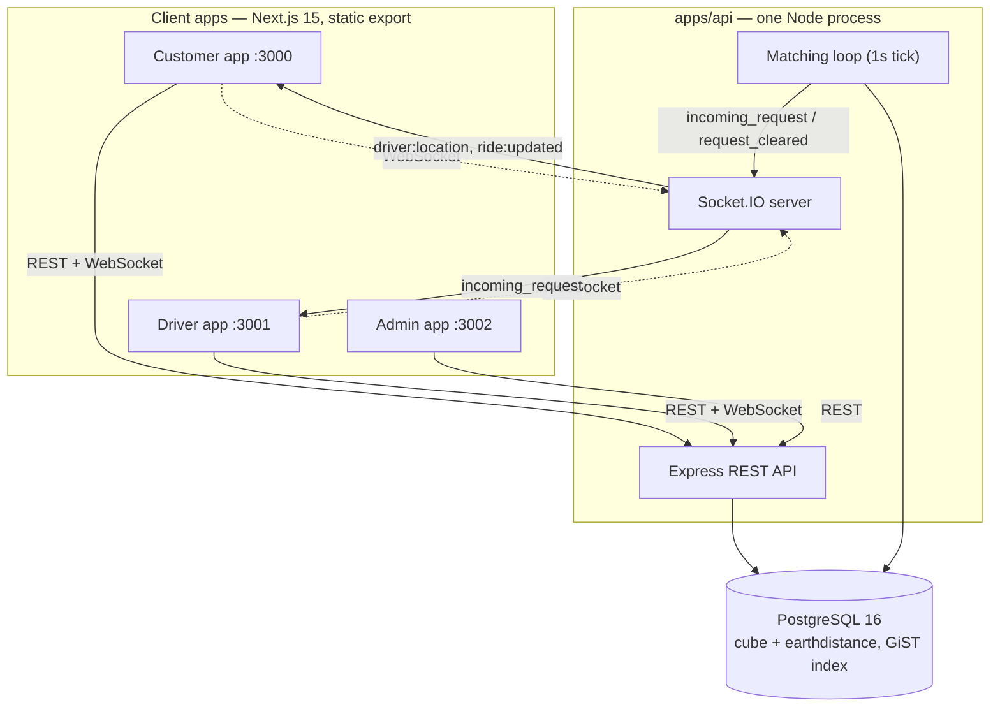

# TRYLO — Architecture

Technical deep-dive into how TRYLO is built. For product scope see
[`PRD.md`](PRD.md); for setup/run instructions see [`README.md`](README.md).

---

## 1. System Overview



The API is a **single Node process** hosting REST, Socket.IO, and an in-process
matching loop together — not three separate services. This is a deliberate
constraint, not an oversight (see §7).

---

## 2. Monorepo Layout

Turborepo + pnpm workspaces, 4 apps + 4 shared packages:

```
apps/
  api/          Express + Socket.IO backend (see §3–§5)
  customer/     Next.js customer app
  driver/       Next.js driver app
  admin/        Next.js admin app

packages/
  types/          Shared TypeScript types (Ride, Driver, Vehicle, MarkerStyle, ...)
  ui/             Shared UI components — PremiumMap (MapLibre), autocomplete, design system
  mock-data/      Shared API client, socket client, React Query hooks — consumed by all 3 frontends
  design-tokens/  Shared Tailwind preset / design tokens
```

All three frontends are 100% client-rendered (`"use client"` throughout, no
server data-fetching, no cookies) and built as Next.js **static exports** —
they're plain static files behind Azure Static Web Apps' CDN, talking to the API
purely over REST + WebSocket via `NEXT_PUBLIC_API_URL`.

---

## 3. Backend: Express App Structure

`apps/api/src/app.ts` builds the Express app; `index.ts` boots the HTTP server,
attaches Socket.IO, and starts the matching loop.

**Middleware stack (in order):** `helmet` → `cors` (allow-listed origins) →
`express.json()` → a global rate limiter → routes → 404 handler → a single error
middleware (via `express-async-errors`, so a rejected/thrown `async` handler
reaches it instead of hanging the request).

**Route groups**, each its own Express Router mounted under a prefix:

| Prefix | File | Covers |
|---|---|---|
| `/api/auth` | `authSession.routes.ts` | Refresh-token session (logout) |
| `/api/customer/auth` | `customerAuth.routes.ts` | Customer OTP login, profile |
| `/api/customer` | `customerMisc.routes.ts` | Fare estimates, saved places, payment methods |
| `/api/customer/rides` | `customerRide.routes.ts` | Book, cancel, rate, status, SOS, chat |
| `/api/customer/wallet` | `customerWallet.routes.ts` | Balance, top-up, transactions |
| `/api/customer/notifications` | `customerNotifications.routes.ts` | Push-style notification feed |
| `/api/driver/auth` | `driverAuth.routes.ts` | Driver OTP login, KYC, vehicle, marker style |
| `/api/driver` | `driverRide.routes.ts` | Requests, accept/reject, location, arrival, OTP verify, end, cancel, SOS, chat |
| `/api/driver/earnings` | `driverEarnings.routes.ts` | Earnings summary, payout records |
| `/api/driver/notifications` | `driverNotifications.routes.ts` | Push-style notification feed |
| `/api/admin/auth` | `adminAuth.routes.ts` | Admin email/password login |
| `/api/admin/dashboard` | `adminDashboard.routes.ts` | Overview stats |
| `/api/admin/customers` | `adminCustomers.routes.ts` | Customer management, suspend |
| `/api/admin/drivers` | `adminDrivers.routes.ts` | Driver management, verify, suspend |
| `/api/admin/rides` | `adminRides.routes.ts` | Ride list, filtering, status history |
| `/api/admin/payments` | `adminPayments.routes.ts` | Wallet/earning transaction views |
| `/api/admin/analytics` | `adminAnalytics.routes.ts` | Ride trends, commission |
| `/api/admin/notifications` | `adminNotifications.routes.ts` | Admin alert feed (e.g. SOS) |

`/health` is unauthenticated and unprefixed — used for uptime checks and to wake
the Container App from scale-to-zero.

**Shared `src/lib/`:** `fare.ts` (fare calc), `geo.ts` (haversine + city-center
jitter for seed data), `wallet.ts`, `commission.ts`, `cancellationPolicy.ts`,
`kyc.ts` (demo auto-verification), `notify.ts` (in-app notification + socket
push), `rideHistory.ts` (audit-trail writes), `serialize.ts` (Prisma row →
public API shape), `adminAudit.ts`, `rateLimiters.ts`, `addresses.ts`.

---

## 4. Data Model

18 Prisma models (`apps/api/prisma/schema.prisma`), PostgreSQL 16. The core
entities:

| Model | Purpose |
|---|---|
| `User` | Customer account + wallet balance |
| `Driver` | Driver account, vehicle fields, location, `markerStyle` |
| `KycDocument` | One row per required KYC doc, per driver |
| `Ride` | The central entity — see §4.1 |
| `RideMessage` | In-ride chat |
| `SosAlert` | Emergency alerts raised by either party |
| `RideStatusHistory` | Append-only audit trail of every status transition |
| `SavedPlace` | Customer's saved addresses (Home/Work/...) |
| `PaymentMethod` | Customer's saved payment methods (UPI/Card/Cash — cosmetic, settlement is always via wallet) |
| `WalletTransaction` | Every wallet debit/credit; `rideId` is unique where set — the DB-level backstop against double-charging a ride |
| `DriverEarning` | One row per successfully-paid ride; `rideId` unique for the same reason |
| `PayoutRecord` | Driver payout history |
| `OtpChallenge` | Pending OTP challenges (customer/driver/dev-hint) |
| `Session` | Refresh-token sessions |
| `Notification` | In-app notification feed, per owner |
| `PromoCode` | Fare-discount codes |
| `Admin` | Admin accounts |
| `AdminActionLog` | Audit trail of admin actions (suspend, verify, etc.) |

### 4.1 The `Ride` State Machine

```
requested → arriving → arrived → in_progress → completed
    ↓           ↓
 cancelled   cancelled
```

- **requested → arriving**: a driver accepts (`POST /driver/requests/:id/accept`),
  itself a compare-and-swap (`updateMany` guarded on `status: "requested"`) — so
  a stale/duplicate accept from a losing driver is a safe no-op, not a bug.
- **arriving → arrived**: automatic, driven by the driver's live GPS (§5.2).
- **arrived → in_progress**: the rider's OTP is verified by the driver
  (`POST /driver/rides/:id/verify-otp`).
- **in_progress → completed**: the driver ends the trip
  (`POST /driver/rides/:id/end`) — this is one atomic transaction that both
  flips status *and* settles payment; see §4.2.
- **→ cancelled**: either party, gated by `CANCELLABLE_STATUSES`
  (`requested`/`matched`/`arriving` for the customer, `arriving`/`arrived` for
  the driver). A late customer cancellation charges a flat fee.

Every transition is written via a **status-guarded `updateMany`** (a
database-level compare-and-swap), never a plain read-then-write — this is the
pattern used consistently across accept/cancel/verify-otp/complete, and it's
what makes concurrent or retried requests safe by construction: only the caller
whose `WHERE` clause still matches actually changes anything; everyone else
gets `count === 0` and reads back the already-decided state instead of
reprocessing it.

### 4.2 Transactional Settlement

Completing a ride and charging a late-cancellation fee both follow the same
shape: **the status-CAS is the first statement inside a Prisma interactive
transaction that also performs the financial write(s).** If anything later in
that transaction throws, Postgres rolls back the *entire* transaction — the
status change included — so the ride reverts to its pre-attempt state and a
retry can safely redo the whole thing. This specifically prevents a ride from
ever being left "completed" with payment permanently stuck pending, or
"cancelled" with its fee permanently unclaimed, if a genuine failure happens
mid-request. Postgres's row lock on the CAS's `UPDATE` is also what serializes
two truly concurrent duplicate requests — the loser blocks until the winner's
transaction resolves, then re-evaluates against the now-committed (or
rolled-back) row.

### 4.3 Geo-Indexed Matching

`Driver.geo` is a **Postgres-generated column** (`ll_to_earth(lat, lng)`,
`earthdistance`/`cube` extensions) — maintained automatically by the database,
never written through Prisma — with a **GiST index**. The matching loop
(`matching/matcher.ts`) searches in expanding rings, `RADIUS_TIERS_METERS =
[1000, 2000, 3000]`, using the indexable `earth_box(...) @> geo` predicate for
the candidate set and `earth_distance(...)` for exact ordering, only widening
the radius if no eligible driver is found. Candidates are additionally filtered
by online status, verification status, suspension, vehicle type, and location
freshness (a stale GPS ping excludes a driver from matching).

---

## 5. Real-Time Layer

Socket.IO, one shared server (`realtime/io.ts`), room-scoped so events only
reach the parties who should see them:

| Room | Joined by | Events emitted into it |
|---|---|---|
| `ride:{rideId}` | Customer + driver on that ride (`join:ride`) | `ride:updated`, `driver:location`, `ride:message:new`, `notification:new` |
| `driver:{driverId}` | That driver, once online (`join:driver`) | `incoming_request`, `request_cleared` |

Clients rejoin their rooms automatically after a reconnect (tracked client-side
in `socketClient.ts`), so a transient network drop doesn't silently stop
updates.

### 5.1 GPS → Live Map Pipeline

```
Driver's browser (watchPosition)
  → POST /api/driver/location  { lat, lng, heading, accuracy }
    → Driver.lat/lng updated
    → emitDriverLocation(rideId, { lat, lng, heading })  → ride:{rideId} room
      → Customer's map (MapLibre marker, rotated to `heading`)
```

`accuracy` is not persisted — it's used once, inline, for the arrival check
below, then discarded.

### 5.2 Arrival Detection

A single noisy GPS fix can no longer mark a driver "arrived." Two conditions
must both hold, evaluated on every location ping while a ride is `arriving`:

1. **Trustworthy fix** — the ping's own reported accuracy radius is ≤75m (a
   fix wider than that can't meaningfully say "within 50m of pickup" either
   way, so it's skipped entirely rather than trusted or distrusted).
2. **2 consecutive** trustworthy, in-radius (≤50m) pings — tracked via
   `Ride.arrivalConfirmations`, incremented with a true database-level
   `{ increment: 1 }` (not a read-then-write) so overlapping pings can't lose
   an increment to a stale read. A trustworthy out-of-radius ping resets the
   counter — guarded by `arrivalConfirmations: { gt: 0 }` in the `WHERE`
   clause itself, evaluated against the *live* row at write time, so the reset
   can't be skipped or misapplied based on a request's own stale snapshot.

Once the fresh post-increment read shows the threshold met, the
`arriving → arrived` transition is itself a status-guarded CAS, so two
overlapping pings that both observe the threshold crossed can't both push the
ride through — only one wins.

### 5.3 Marker Styles

A driver picks a cosmetic marker style (`classic` / `arrow` / `beacon` /
`compact`) from their profile (`Driver.markerStyle`). It's purely visual — the
vehicle icon shown inside the marker always reflects the driver's actual
`VehicleType`, independent of style — and it renders identically (including
heading rotation) on both the driver's own map and the customer's live map for
that ride, since both read the same `Driver` object.

---

## 6. Matching Loop

`startMatchingLoop()` runs a single `setInterval` tick (guarded by an
in-flight flag so a slow tick can't overlap the next one) that does three
things every pass:

1. **`expireStaleOffers`** — an offer that timed out without the driver
   responding is cleared and the ride goes back to unmatched.
2. **`offerUnassignedRides`** — for each `requested` ride with no current
   offer, runs the progressive-radius search (§4.3) and pushes
   `incoming_request` to the winning driver's socket room.
3. **`expireStaleActiveRides`** — auto-cancels a ride abandoned mid-flow
   (`arriving`/`arrived`/`in_progress`) past a timeout, so a disconnected
   driver doesn't strand a rider indefinitely.

This is intentionally an **in-process, single-instance** loop — see §7.

---

## 7. Deliberate Single-Instance Constraint

Two pieces of server state are **in-memory and process-local**: the Socket.IO
connection/room state, and the matching loop above. Neither is backed by
Redis or any shared store. This means the API **must** run as exactly one
replica — horizontally scaling it would split rooms/offers across processes
that can't see each other. In production this deployment runs Azure Container
Apps with `maxReplicas=1` specifically because of this, not as an oversight;
scaling this out for real would mean adding a Redis Socket.IO adapter and
externalizing the matching loop's coordination — deliberately out of scope for
this project (see `PRD.md` §7).

---

## 8. Authentication

- **Customer/Driver:** phone number + 4-digit OTP (`OtpChallenge` model).
  In this deployment the OTP is returned directly in the API response
  (`devHintOtp`) rather than sent via a real SMS provider — a documented,
  intentional simplification for controlled testing.
- **Admin:** email + password (bcrypt via `auth/password.ts`), no OTP.
- **Tokens:** short-lived (15 min) JWT access tokens (`auth/jwt.ts`) plus a
  longer-lived refresh token (`Session` model, `auth/refreshToken.ts`) —
  `/api/auth/logout` revokes the session server-side.
- **Authorization:** `requireAuth("customer" | "driver" | "admin")` middleware
  checks the JWT's role claim per-route; cross-role tokens are rejected (a
  customer token on an admin route, etc.).
- **Rate limiting:** a generous global limiter (300 req/min/IP) as an abuse
  backstop, plus tighter dedicated limiters on OTP request/verify and admin
  login (8 attempts/15min, keyed by IP+phone or IP+email) since those are the
  actual brute-force-sensitive endpoints.

---

## 9. Deployment Topology

```
GitHub push to main
  ├─ apps/api changed  → build Docker image → push to ghcr.io → az containerapp update
  └─ apps/{customer,driver,admin} or shared packages changed
       → next build (static export) → deploy to the matching Azure Static Web App
```

| Resource | Type | Notes |
|---|---|---|
| `trylo-api` | Azure Container Apps, Consumption | `minReplicas=0`/`maxReplicas=1` — scales to zero when idle, single-instance always (§7) |
| `trylo-db` | Azure Database for PostgreSQL, Flexible Server, Burstable B1ms | Started/stopped manually around test sessions (`scripts/azure-test-env.ps1`) — the one resource that costs money while idle |
| `trylo-customer` / `trylo-driver` / `trylo-admin` | Azure Static Web Apps, Free tier | CDN-served static exports, always-on at $0 |

Prisma migrations are applied to the live database with `prisma migrate
deploy` (never `migrate dev`, which fights the hand-written generated `geo`
column) — currently a manual step via `az containerapp exec` after a schema
change ships, not yet wired into the CI/CD pipeline itself.

Full local-dev setup and Azure resource management commands are in
[`README.md`](README.md).

---

## 10. Key Design Decisions

| Decision | Why |
|---|---|
| Compare-and-swap (`updateMany` + status guard) for every state transition | Makes concurrent/retried requests safe without needing application-level locks |
| Status transition + financial write in one Prisma transaction | A genuine mid-request failure can't leave a ride permanently stuck half-applied |
| Postgres-generated `geo` column + GiST index over a GIS extension | Index-backed proximity search without the operational weight of PostGIS |
| Progressive-radius matching (1→2→3km) | Cheaper than scanning all drivers up front; matches the common case (a nearby driver exists) fast |
| Socket.IO rooms per ride/driver, not a global broadcast | Updates only reach the parties who should see them |
| Single-instance API (no Redis adapter) | Matches actual test-scale needs (two devices) without adding infra complexity that isn't needed yet |
| Static-export frontends, no SSR | Zero server-rendering dependency (confirmed: no middleware, no cookies) → deployable to a free CDN tier instead of a Node host |
| Internal wallet instead of a real payment gateway | Keeps settlement logic (the interesting part) real and testable without a live payments integration |
